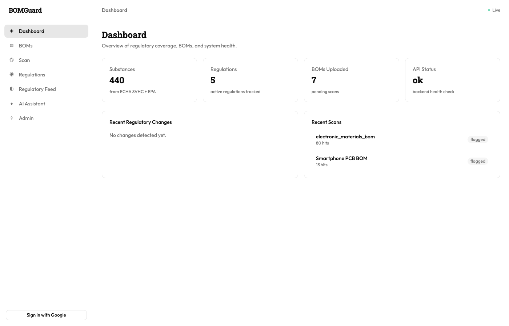
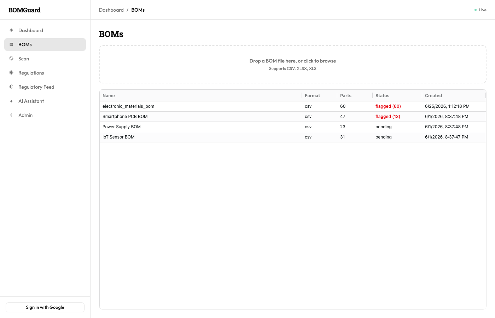
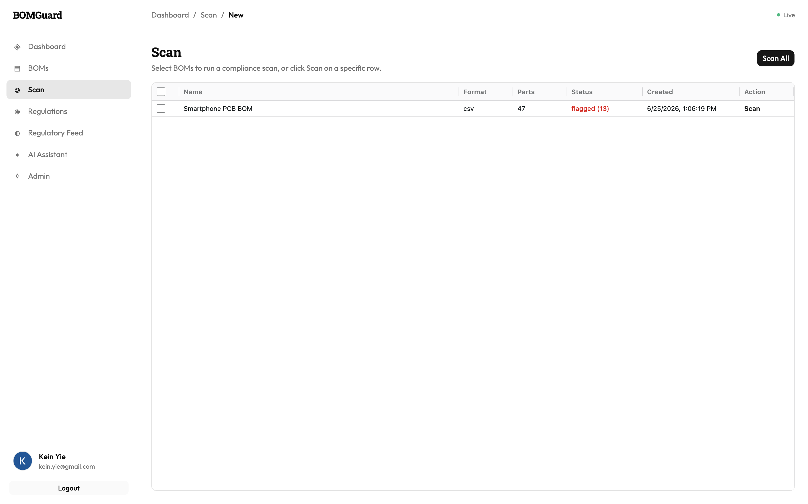
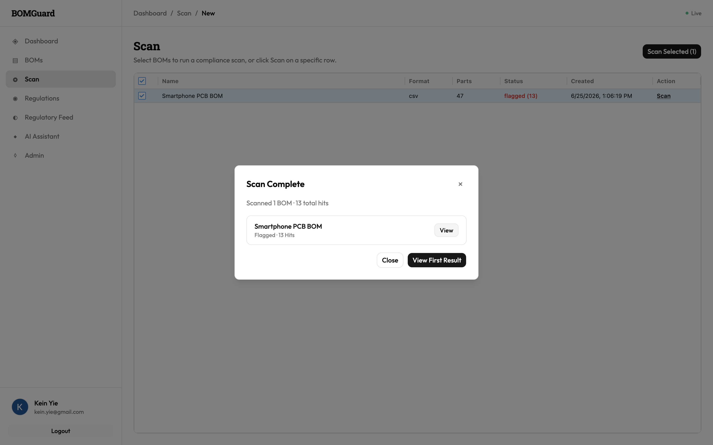
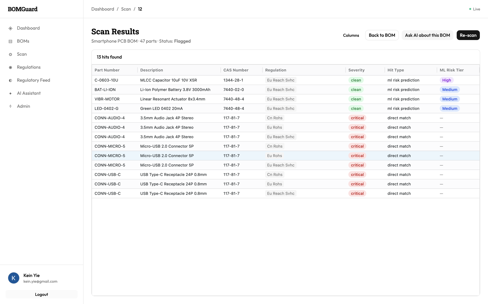
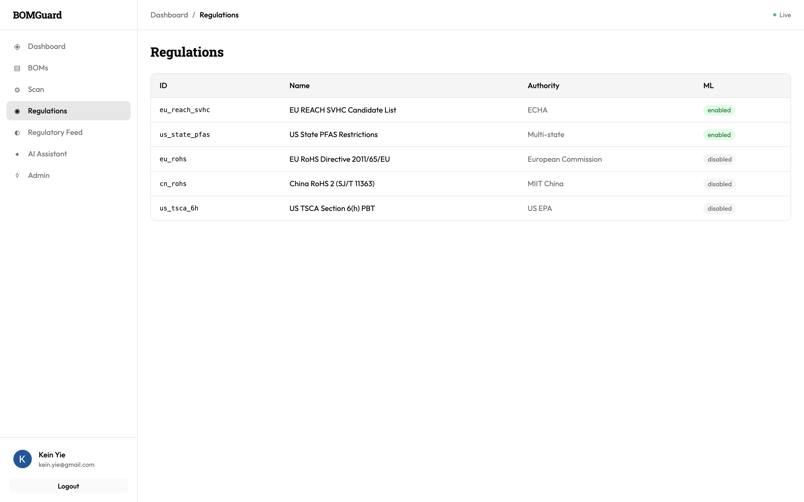
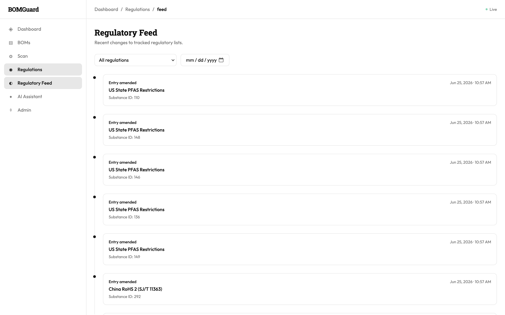
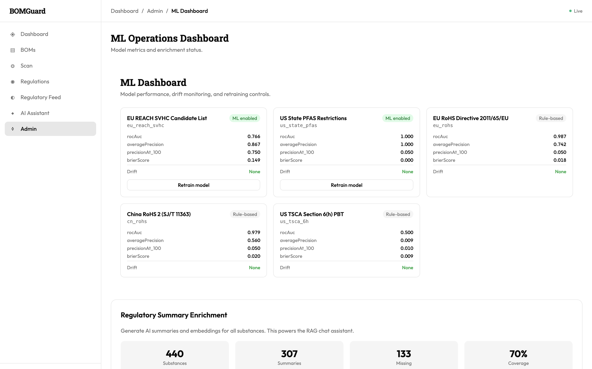
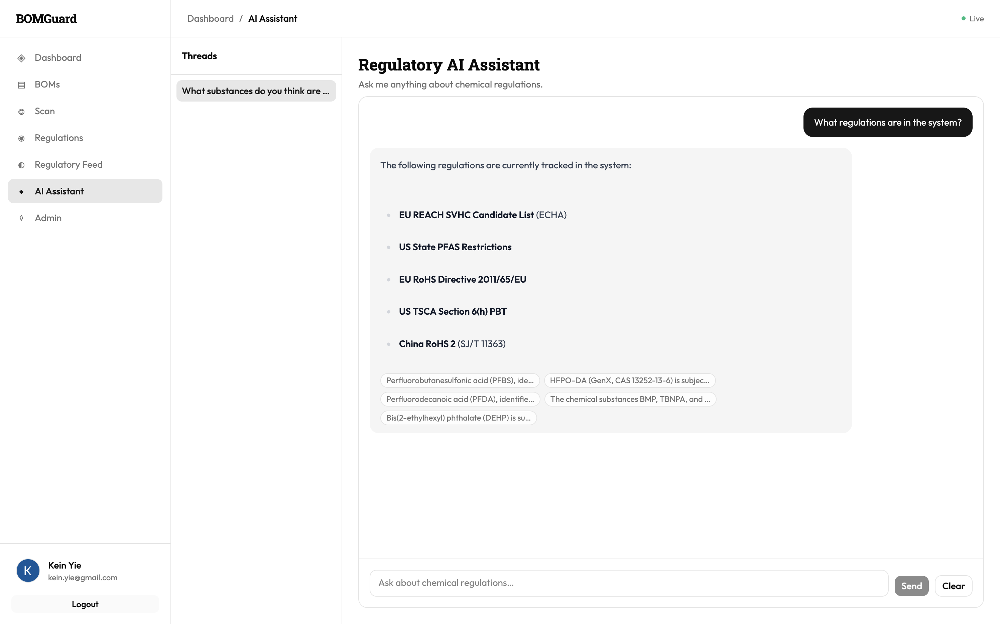

# BOMGuard

Open-source Bill of Materials (BOM) compliance scanner for the electronics manufacturing industry.

## Features

- **Live regulatory data ingestion** — ECHA REACH SVHC, EU RoHS, US TSCA 6(h), China RoHS 2, US State PFAS
- **BOM compliance scanning** — multi-regulation simultaneous scanning with fuzzy column detection
- **ML risk prediction** — XGBoost + Optuna with SHAP interpretability and model registry
- **LLM-powered Q&A** — BOM-aware RAG pipeline with Gemini embeddings and OpenRouter chat models
- **MLOps pipeline** — Airflow DAG, MLflow tracking, Evidently AI drift monitoring
- **Real-time alerts** — WebSocket regulatory change notifications
- **Monitoring** — Prometheus metrics and Grafana dashboards

## Tech Stack

| Layer | Technology |
|-------|-----------|
| API | FastAPI + Python 3.12 |
| Frontend | React 19 + TypeScript + Tailwind CSS + shadcn/ui |
| Database | PostgreSQL 16 + pgvector |
| Cache / Queue | Redis 7 + Celery |
| ML | XGBoost + Optuna + SHAP |
| LLM | Gemini embeddings + OpenRouter chat |
| Monitoring | Prometheus + Grafana |
| Orchestration | Apache Airflow |

## Screenshots

### Dashboard



### BOM upload & management



### Run a compliance scan





### Scan results with ML risk overlay



### Tracked regulations



### Regulatory change feed



### ML operations dashboard



### Regulatory AI Assistant



## BOM-aware AI Assistant

You can open the Regulatory AI Assistant directly from a scan results page (or BOM detail page) by clicking **Ask AI about this BOM**. When a BOM context is active, every question automatically includes the BOM’s ML-predicted high/medium risk substances in the RAG context, so you can ask things like:

- “Which substances in this BOM are high risk?”
- “Summarize the REACH concerns for this BOM.”

### Try it

1. Scan a BOM and open the scan results.
2. Click **Ask AI about this BOM**.
3. Type a regulatory question about the BOM.


## ML risk prediction in scan results

Scan results include separate **ML Risk Tier** and **ML Risk Score** columns. Rows with a high ML risk prediction are highlighted in purple, making it easy to distinguish model predictions from direct regulatory matches.


## Quick Start

### Full Docker Compose stack

```bash
# Copy example environment variables
cp .env.example .env
# Edit .env and add your API keys (GEMINI_API_KEY, OPENROUTER_API_KEY, WORKOS_*)

# Build and start all services
docker compose up --build -d

# Verify health
open http://localhost:8000/api/health
```

### Local development

```bash
# Install dependencies
make install

# Start infrastructure
docker compose up db redis mlflow -d

# Run migrations and start backend (terminal 1)
cd backend
uv run alembic upgrade head
uv run uvicorn bomguard.main:create_app --factory --reload

# Start frontend (terminal 2)
cd frontend
npm run dev
```

### Required environment variables

| Variable | Purpose |
|----------|---------|
| `DATABASE_URL` | PostgreSQL connection string |
| `REDIS_URL` | Redis connection string |
| `GEMINI_API_KEY` | Gemini embeddings for RAG |
| `OPENROUTER_API_KEY` | OpenRouter LLM chat |
| `WORKOS_API_KEY` / `WORKOS_CLIENT_ID` | Google OAuth (optional) |
| `ADMIN_API_KEY` | Protects admin enrichment/retrain endpoints |
| `SECRET_KEY` | Session cookie signing |

See `.env.example` for the full list.

## Development

```bash
make lint      # Run all linters
make format    # Auto-format code
make test      # Run all tests
```

## Manual E2E QA

After starting the full stack:

```bash
python scripts/manual_qa.py --base-url http://localhost:8000 --admin-key "$ADMIN_API_KEY"
```

## License

MIT
